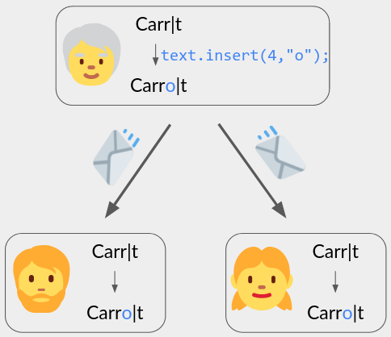
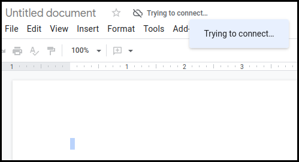
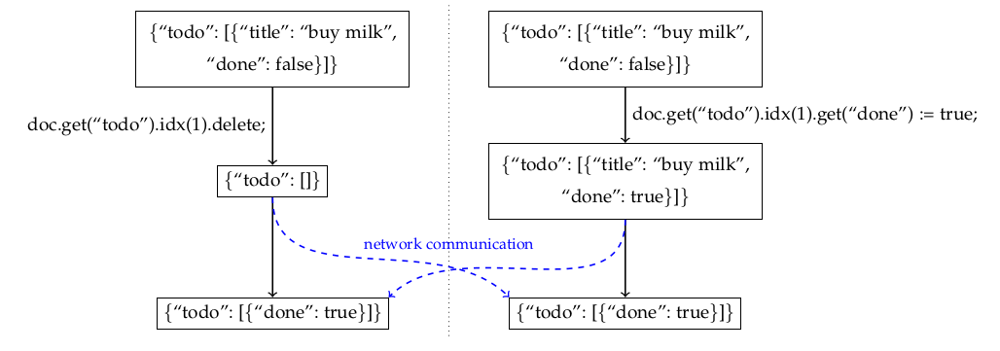
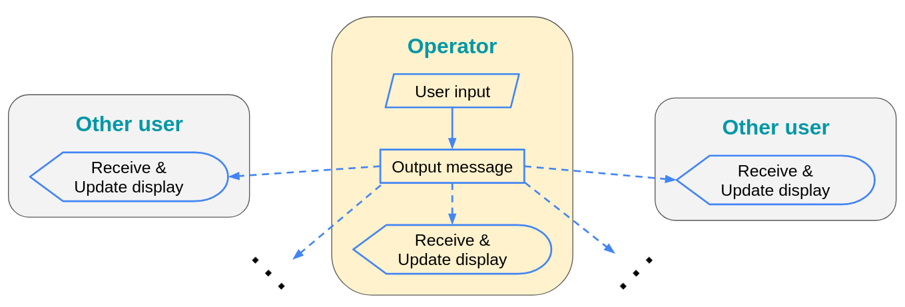
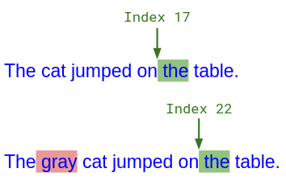
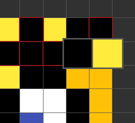

+++
# The title of your blogpost. No sub-titles are allowed, nor are line-breaks.
title = "Designing Data Structures for Collaborative Apps"
# Date must be written in YYYY-MM-DD format. This should be updated right before the final PR is made.  TODO
date = 2021-11-15

[taxonomies]
# Keep any areas that apply, removing ones that don't. Do not add new areas!
areas = ["Systems", "Programming Languages"]
# Tags can be set to a collection of a few keywords specific to your blogpost.
# Consider these similar to keywords specified for a research paper.
tags = ["collaborative apps", "data structures", "CRDTs", "eventual consistency"]

[extra]
# For the author field, you can decide to not have a url.
# If so, simply replace the set of author fields with the name string.
# For example:
#   author = "Harry Bovik"
# However, adding a URL is strongly preferred
author = {name = "Matthew Weidner", url = "http://mattweidner.com/" }
# The committee specification is simply a list of strings.
# However, you can also make an object with fields like in the author.
committee = [
    {name = "Jonathan Aldrich", url = "https://www.cs.cmu.edu/~aldrich/"},
    {name = "Justine Sherry", url = "https://www.justinesherry.com/"},
    {name = "Pratik Fegade", url = "https://pratikfegade.github.io/"},
]
+++

# Introduction: Collaborative Apps via CRDTs

Suppose you're building a collaborative app, along the lines of Google Docs/Sheets/Slides, Figma, Notion, etc., but *without a central server*. One challenge you'll face is the actual collaboration: when one user changes the shared state, their changes need to show up for every other user. For example, if multiple users type at the same time in a text field, the result should reflect all of their changes and be consistent (identical for all users).

[**Conflict-free Replicated Data Types (CRDTs)**](https://en.wikipedia.org/wiki/Conflict-free_replicated_data_type) provide a solution to this challenge. They are data structures that look like ordinary data structures (maps, sets, text strings, etc.), except that they are collaborative: when one user updates their copy of a CRDT, their changes automatically show up for everyone else. Each user sees their own changes immediately, while under the hood, the CRDT broadcasts a message describing the change to everyone else.  Other users see the change once they receive this message.



Note that multiple users might make changes at the same time, e.g., both typing at once. Since each user sees their own changes immediately, their views of the document will temporarily diverge. However, CRDTs guarantee that once the users receive each others' messages, they'll see identical document states again: this is the definition of **CRDT correctness**. Ideally, this state will also be "reasonable", i.e., it will incorporate both of their edits in the way that the users expect.

> In distributed systems terms, CRDTs are *Available*, *Partition tolerant*, and have *Strong Eventual Consistency*.

<p></p><br />

CRDTs work even if messages might be arbitrarily delayed, or delivered to different users in different orders. This lets you make collaborative experiences that don't need a central server, work offline, and/or are end-to-end encrypted ([**local-first software**](https://www.inkandswitch.com/local-first/)).


<p align="center"><i>CRDTs allow offline editing, unlike Google Docs.</i></p>

I'm particularly excited by the potential for **open-source collaborative apps** that anyone can distribute or modify, without requiring app-specific hosting.

## The Challenge: Designing CRDTs

Having read all that, let's say you choose to use a CRDT for your collaborative app. All you need is a CRDT representing your app's state, a frontend UI, and a network of your choice (or a way for users to pick the network themselves). But where do you get a CRDT for your specific app?

If you're lucky, it's described in a [paper](https://crdt.tech/papers.html), or even better, implemented in a [library](https://crdt.tech/implementations). But those tend to have simple or one-size-fits-all data structures: maps, text strings, unstructured JSON, etc. You can usually rearrange your app's state to make it fit in these CRDTs; and if users make changes at the same time, CRDT correctness guarantees that you'll get *some* consistent result. However, it might not be what you or your users expect. Worse, you have little leeway to customize this behavior.


<p align="center"><i>
In a <a href="https://doi.org/10.1109/TPDS.2017.2697382" target="_blank">published JSON CRDT</a>, when representing a todo-list using items with "text" and "done" fields, you can end up with an item having no "text" field.
</i></p>

<!--figure: hypothetical user Q&A asking for a change in the conflict-resolution, and you just reply "sorry".-->

This blog post will instead teach you how to design CRDTs from the ground up. I'll present a few simple CRDTs that are obviously correct, plus ways to compose them together into complicated whole-app CRDTs that are still obviously correct. I'll also present principles of CRDT design to help guide you through the process. To cap it off, we'll design a CRDT for a collaborative spreadsheet.

**Ultimately, I hope that you will gain not just an understanding of some existing CRDT designs, but also the confidence to tweak them and create your own!**

## Related Work

The approach in this blog post is my own way of thinking about CRDT design. It's inspired by the way [Figma](https://www.figma.com/blog/how-figmas-multiplayer-technology-works/) and [Hex](https://hex.tech/blog/a-pragmatic-approach-to-live-collaboration) describe their collaboration platforms; they likewise support complex apps by composing simple, easy-to-reason-about pieces. However, I incorporate more techniques from academic CRDT designs, enabling more flexible behavior and server-free operation.

<!--I'll describe most CRDTs in terms of an implementation, because I find implementations easier to explain. However, my real goal is to describe their *semantics*: what users see after they perform various operations, possibly concurrently. If you can find alternate implementations that have the same behavior as the ones I describe but are more efficient, then by all means, use those instead. -->

# Basic Designs

I'll start by going over some basic CRDT designs.

## Unique Set

Our foundational CRDT is the **Unique Set**.  It is a set in which each added element is considered unique.

Formally, the user-facing operations on the set, and their collaborative implementations, are as follows:
- `add(x)`: Adds an element `e = (x, t)` to the set, where `t` is a *unique new tag*, used to ensure that `(x, t)` is unique. To implement this, the adding user generates `t`, e.g., as a pair (device id, device-specific counter), then serializes `(x, t)` and broadcasts it to the other users.  The receivers deserialize `(x, t)` and add it to their local copy of the set.
- `delete(e)`: Deletes the element `e = (x, t)` from the set.  To implement this, the deleting user serializes `t` and broadcasts it to the other users.  The receivers deserialize `t` and remove the element with tag `t` from their local copy, if it has not been deleted already.


<p align="center"><i>The lifecycle of an <code>add</code> or <code>delete</code> operation.</i></p>

When displaying the set to the user, you ignore the tags and just list out the data values `x`, keeping in mind that (1) they are not ordered (at least not consistently across different users), and (2) there may be duplicates.

**Example:** In a collaborative flash card app, you could represent the deck of cards as a unique set, using `x` to hold the flash card's value (e.g., its front and back strings). Users can edit the deck by adding a new card or deleting an existing one, and duplicate cards are allowed. <!--Note that the collaborative state is just the *set* of cards; there is no ordering info. You could perhaps sort them alphabetically in editing mode (to make them consistent), and randomly in practice mode (deliberately inconsistent).-->

<a name="causal-order"></a>When broadcasting messages, we require that they are delivered *reliably* and *in causal order*, but it's okay if they are arbitarily delayed.  (These rules apply to all CRDTs, not just the unique set.) Delivery **in causal order** means that if a user sends a message \\(m\\) after receiving or sending a message \\(m^\prime\\), then all users delay receiving \\(m\\) until after receiving \\(m^\prime\\). This is the strictest ordering we can implement without a central server and without extra round-trips between users, e.g., by using [vector clocks](https://en.wikipedia.org/wiki/Vector_clock).

Messages that aren't ordered by the causal order are **concurrent**, and different users might receive them in different orders. But for **correctness**/**consistency**, we must ensure that all users end up in the same state regardless, once they have received the same messages.

For the unique set, it is obvious that the state of the set, as seen by a specific user, is always the set of elements for which they have received an `add` message but no `delete` messages. This holds regardless of the order in which they received concurrent messages. Thus the unique set is correct.

> Note that delivery in causal order is important---a `delete` operation only works if it is received after its corresponding `add` operation.

<p></p><br />

We now have our first principle of CRDT design:

<a name="principle-1"></a>**Principle 1. Use the unique set CRDT for operations that "add" or "create" a unique new thing.**

Although it is simple, the unique set forms the basis for the rest of our CRDTs.

<!-- > **Aside.** There is a sense in which the unique set is "CRDT-complete", i.e., it can be used to implement any CRDT semantics: you use a unique set to store the complete operation history together with causal ordering info, then compute the state as a function of this history.

<p></ p><br /> -->

## Lists

Our next CRDT is a **list CRDT**. It represents a list of elements, with `insert` and `delete` operations. For example, you can use a list CRDT of characters to store the text in a collaborative text editor, using `insert` to type a new character and `delete` for backspace.

Formally, the operations on a list CRDT are:
- `insert(x, i)`: Inserts a new element with value `x` at index `i`, between the existing elements at indices `i` and `i+1`. All later elements (index `>= i+1`) are shifted one to the right.
- `delete(i)`: Deletes the element at index `i`. All later elements (index `>= i+1`) are shifted one the left.

We now need to decide on the semantics, i.e., what is the result of various insert and delete operations, possibly concurrent. The fact that insertions are unique suggests using a unique set ([Principle 1](#principle-1)). However, we also have to account for indices and the list order.

One approach would use indices directly: when a user calls `insert(x, i)`, they send `x` and `i` to the other users, who use `i` to insert `x` at the appropriate location. The challenge is that your intended insertion index might move around as a result of users inserting/deleting in front of `i`.


<p align="center"><i>Alice typed " the" at index 17, but concurrently, Bob typed " gray" in front of her. From Bob's perspective, Alice's insert should happen at index 22.</i></p>

Its possible to work around this by "transforming" `i` to account for concurrent edits. That idea loads to [**Operational Transformation (OT)**](https://en.wikipedia.org/wiki/Operational_transformation), the earliest-invented approach to collaborative text editing, and the one used in Google Docs and most existing apps. Unfortunately, OT algorithms are quite complicated, especially when you don't have a central server to help you.

<!--Several incorrect attempts at server-free OT were published before the [first correct one](https://core.ac.uk/download/pdf/54049928.pdf) in 2005 (cite, check correctness via citations)---the same year the [first CRDT paper](https://hal.inria.fr/inria-00071240/document) was published. -->

List CRDTs use a different perspective.  When you type a character in a text document, you probably don't think of its position as "index 17" or whatever; instead, its position is at a certain place within the existing text.

"A certain place within the existing text" is vague, but at a minimum, it should be between the characters left and right of your insertion point ("on" and " table" in the example above)  Also, unlike an index, this intuitive position doesn't change if other users concurrently type earlier in the document; your new text should go between the same characters as before. That is, the position is *immutable*.

This leads to the following implementation. The list's state is a unique set whose values are pairs `(x, p)`, where `x` is the actual value (e.g., a character), and `p` is a **unique immutable position** drawn from some abstract total order. The user-visible state of the list is the list of values `x` ordered by their positions `p`. Operations are implemented as:
- `insert(x, i)`: The inserting user looks up the positions `pL`, `pR` of the values to the left and right (indices `i` and `i+1`), generates a unique new position `p` such that `pL < p < pR`, and calls `add((x, p))` on the unique set. 
- `delete(i)`: The deleting user finds the element `e` of the unique set at index `i`, then calls `delete(e)` on the unique set.

Of course, we need a way to create the positions `p`. That's the hard part---in fact, the hardest part of any CRDT---and I don't have space to go into it here; you should use an existing algorithm (e.g., [RGA](http://dx.doi.org/10.1016/j.jpdc.2010.12.006)) or implementation (e.g., [Yjs's `Y.Array`](https://docs.yjs.dev/api/shared-types/y.array)).  <!--Generally, solutions involve a tree, sorted by the tree walk on nodes; you create a unique new position in between `pL` and `pR` by adding a new leaf somewhere between `pL` and `pR`, e.g., as a right child of `pL`.-->

The important lesson here is that we had to translate indices (the language of normal, non-CRDT lists) into unique immutable positions (what the user intuitively means when they say "insert here").  That leads to our second principle of CRDT design:

<a name="principle-2"></a>**Principle 2. Express operations in terms of user intention---what the operation means to the user, intuitively. This might differ from the closest ordinary data type operation.**

This principle works because users often have some idea what one operation should do in the face of concurrent operations. If you can capture that intuition, then the resulting operations won't conflict.

## Registers

Our last basic CRDT is the **register**. This is a variable that holds an arbitrary value that can be set and get. If multiple users set the value at the same time, you pick one of them arbitrarily, or perhaps average them together.

**Example uses for registers:**
- The font size of a character in a collaborative rich-text editor.
- The name of a document.
- The color of a specific pixel in a collaborative whiteboard.
- Basically, anything where you're fine with users overwriting each others' concurrent changes and you don't want to use a more complicated CRDT.

Registers are very useful and suffice for many tasks (e.g., [Figma](https://www.figma.com/blog/how-figmas-multiplayer-technology-works/) and [Hex](https://hex.tech/blog/a-pragmatic-approach-to-live-collaboration) use them almost exclusively).

The only operation on a register is `set(x)`, which sets the value to `x` (in the absence of concurrent operations). We can't perform these operations literally, since if two users receive concurrent `set` operations in different orders, they'll end up with different values.

However, we can *add* the value `x` to a unique set, following [Principle 1](#principle-1). The state is now a set of values instead of a single value, but we'll address that soon. We can also delete old values each time `set(x)` is called, overwriting them.


Thus the implementation of `set(x)` becomes:
- For each element `e` in the unique set, call `delete(e)` on the unique set; then call `add(x)`.

The result is that at any time, the register's state is the set of all the most recent concurrently-set values.

Loops of the form "for each element of a collection, do something" are common in programming. We just saw a way to extend them to CRDTs: "for each element of a unique set, do some CRDT operation". We call this a **causal for-each operation** because it only affects elements that are prior to the for-each operation in the [causal order](#causal-order). It's useful enough that we make it our next principle of CRDT design:

<a name="principle-3a"></a>**Principle 3a. For operations that do something "for each" element of a collection, one option is to use a *causal for-each operation* on a unique set (or list CRDT).**

Returning to registers, we still need to handle the fact that our state is a set of values, instead of a specific value.

One option is to accept this as the state, and present all conflicting values to the user.  That gives the **Multi-Value Register (MVR)**.

<a name="lww-register"></a>Another option is to pick a value arbitrarily but deterministically.  E.g., the **Last-Writer Wins (LWW) Register** tags each value with the wall-clock time when it is set, then picks the value with the latest timestamp.


<p align="center"><i>In <a href="https://medium.com/@pvh/pixelpusher-real-time-peer-to-peer-collaboration-with-react-7c7bc8ecbf74" target="_blank">Pixelpusher</a>, a collaborative pixel art editor, each pixel shows one color by default (LWW Register), but you can click to pop out all conflicting colors (MVR). Image credit: Peter van Hardenberg (<a href="https://miro.medium.com/max/270/1*tXSBtdqf6yBCO6i77VVH1A.png" target="_blank">original</a>).</i></p>

In general, you can define the value getter to be an arbitrary deterministic function of the set of values.

**Examples:**
- If the values are colors, you can average their RGB coordinates. That seems like fine behavior for pixels in a collaborative whiteboard.

<!--figure: illustration-->

- <a name="enable-wins-flag"></a>If the values are booleans, you can choose to prefer `true` values, i.e., the register's value is `true` if its set contains any `true` values. That gives the **Enable-Wins Flag**.

# Composing CRDTs

We now have enough basic CRDTs to start making more complicated data structures through composition. I'll describe three techniques: CRDT objects, CRDT-valued maps, and collections of CRDTs.

## CRDT Objects

The simplest composition technique is to use multiple CRDTs side-by-side. By making them be instance fields in a class, you obtain a **CRDT Object**, which is itself a CRDT (trivially correct). The power of CRDT objects comes from using standard OOP techniques, e.g., implementation hiding.

**Examples:**
- In a collaborative flash card app, to make individual cards editable, you could represent each card as a CRDT object with two text CRDT instance fields, one for the front and one for the back.
- You can represent the position and size of an image in a collaborative slide editor by using separate registers for the left, top, width, and height. <!--To get a complete image object, you might also add registers for border color/size/style, a text CRDT for the caption, a register for the image source (unless it's immutable, in which case you can use an ordinary, non-CRDT instance field), etc.-->
<!--- Recall that we defined lists and registers in terms of the unique set. We can consider these as CRDT objects as well, even though they just have one instance field (the set). The object lets us delegate operations and reads to the inner set while exposing the API of a list/register.-->

## CRDT-Valued Map

A CRDT-valued map is like a CRDT object but with potentially infinite instance fields, one for each allowed map key. Every key/value pair is implicitly always present in the map, but values are only explicitly constructed in memory as needed, using a predefined factory method (like Apache Commons' [LazyMap](https://commons.apache.org/proper/commons-collections/apidocs/org/apache/commons/collections4/map/LazyMap.html)).

**Examples:**
- Consider a shared notes app in which users can archive notes, then restore them later. To indicate which notes are normal (not archived), we want to store them in a set. A unique set won't work, since the same note can be added (restored) multiple times. Instead, you can use a CRDT-valued map whose keys are the documents and whose values are [enable-wins flags](#enable-wins-flag); the value of the flag for key `doc` indicates whether `doc` is in the set. This gives the **Add-Wins Set**.
- [Quill](https://quilljs.com/) lets you easily display and edit rich text in a browser app. In a Quill document, each character has an `attributes` map, which contains arbitrary key-value pairs describing formatting (e.g., `"bold": true`). You can model this using a CRDT-valued map with arbitrary keys and [LWW register](#lww-register) values; the value of the register for key `attr` indicates the current value for `attr`.

<!-- > If you want a non-lazy map, in which keys have explicit membership and can be deleted (technically needed for the Quill example), you can use a lazy CRDT-valued map plus an add-wins set to track which keys are present.

<p></p><br /> -->

## Collections of CRDTs

Our above definition of a unique set implicitly assumed that the data values `x` were immutable and serializable (capable of being sent over the network). However, we can also make a **unique set of CRDTs**, whose values are dynamically-created CRDTs.

To add a new value CRDT, a user sends a unique new tag and any arguments needed to construct the value. Each recipient passes those arguments to a predefined factory method, then stores the returned CRDT in their copy of the set.

We can likewise make a **list of CRDTs**.

**Examples:**
- In a shared folder containing multiple collaborative documents, you can define your document CRDT, then use a unique set of document CRDTs to model the whole folder.
<!--- In a todo-list app, you can define a "todo-item CRDT" with fields `text` and `done`, giving the item text and whether it is done. The whole app's state is then a list of todo-item CRDTs.-->
- Continuing the Quill rich-text example from the previous section, you can model a rich-text document as a list of "rich character CRDTs", where each "rich character CRDT" consists of an immutable (non-CRDT) character plus the `attributes` map CRDT. This is sufficient to build [a simple Google Docs-style app with CRDTs](https://compoventuals-tests.herokuapp.com/host.html?network=ws&container=demos/rich-text/dist/rich_text.html) ([source](https://github.com/composablesys/collabs/blob/master/demos/rich-text/src/rich_text.ts)).

## Using Composition

You can use the above composition techniques and basic CRDTs to design CRDTs for many collaborative apps. Choosing the exact structure, and how operations and user-visible state map onto that structure, is the main challenge.

A good starting point is to design an ordinary (non-CRDT) data model, using ordinary objects, collections, etc., then convert it to a CRDT version. So variables become registers, objects become CRDT objects, lists become list CRDts, sets become unique sets or add-wins sets, etc. You can then tweak the design as needed to accommodate extra operations or fix weird concurrent behaviors.

To accommodate as many operations as possible while preserving user intention, I recommend:

<a name="principle-4"></a>**Principle 4. Independent operations (in the user's mind) should act on independent state.**

**Examples:**
- As mentioned earlier, you can represent the position and size of an image in a collaborative slide editor by using separate registers for the left, top, width, and height. If you wanted, you could instead use a single register whose value is a tuple (left, top, width, height), but this would violate Principle 4. Indeed, then if one user moved the image while another resized it, one of their changes would overwrite the other, instead of both moving and resizing. <!--Likewise, it would be a mistake to replace (left, top, width, height) with (left, top, right, bottom) (this also violates [Principle 2](#principle-2)).-->
- Again in a collaborative slide editor, you might initially model the slide list as a list of slide CRDTs. However, this provides no way for users to move slides around in the list, e.g., swap the order of two slides. You could implement a move operation using cut-and-paste, but then slide edits concurrent to a move will be lost, even though they are intuitively independent operations.<br />
<a name="list-with-move"></a>Following Principle 4, you should instead implement move operations by modifying some state independent of the slide itself. You can do this by replacing the *list* of slides with a *set of pairs* `(slide, positionReg)`, where `positionReg` is an LWW register indicating the position. To move a slide, you create a unique new position like in a list CRDT, then set the value of `positionReg` equal to that position. This construction gives the [**list-with-move**](https://doi.org/10.1145/3380787.3393677) CRDT.

# New: Concurrent+Causal For-Each Operations

There's one more trick I want to show you. Sometimes, when performing a for-each operation on a unique set or list CRDT ([Principle 3a](#principle-3a)), you don't just want to affect existing (causally prior) elements. You also want to affect *elements that are added/inserted concurrently*.

For example:
- In a rich text editor, if one user bolds a range of text, while concurrently, another user types in the middle of the range, the latter text should also be bolded.
<br />

<br />
In other words, the first user's intended operation is "for each character in the range *including ones inserted concurrently*, bold it".
- In a collaborative recipe editor, if one user clicks a "double the recipe" button, while concurrently, another user edits an amount, then their edit should also be doubled. Otherwise, the recipe will be out of proportion, and the meal will be ruined!

I call such an operation a **concurrent+causal for-each operation**. To accomodate the above examples, I propose:

<a name="principle-3b"></a>**Principle 3b. For operations that do something "for each" element of a collection, another option is to use a *concurrent+causal for-each operation* on a unique set (or list CRDT).**

To implement this, the initiating user first does a causal for-each operation. They then send a message describing how to perform the operation on concurrently added elements. The receivers apply the operation to any concurrently added elements they've received already (and haven't yet deleted), then store the message in a log. Later, each time they receive a new element, they check if it's concurrent to the stored message; if so, they apply the operation.

<!-- > **Aside.** It would be more general to split Principle 3 into "causal for-each" and "concurrent for-each" operations. However, I haven't yet found a good use-case for a concurrent for-each operation that isn't part of a concurrent+causal for-each.

<p></p><br /> -->

Concurrent+causal for-each operations are novel as far as I'm aware. They are based on [a paper](https://doi.org/10.1145/3408976) I, [Heather Miller](https://heather.miller.am/), and [Christopher Meiklejohn](http://christophermeiklejohn.com/) wrote last year, about a composition technique we call the *semidirect product*, which can implement them (albeit in a confusing way). <!--Unfortunately, the paper doesn't make clear what the semidirect product is doing intuitively (since we didn't understand this ourselves!). My current opinion is that concurrent+causal for-each operations are what it's really trying to do; the semidirect product is a special case of an optimized implementation, but written in the confusing traditional style (implementation + proof that concurrent operations commute). -->

<!-- > If you do want to use the semidirect product as an optimized implementation, be aware that it is not as general as it could be. E.g., the recipe example can be optimized, but not using the semidirect product. I'll write up a tech report about a more general approach at some point.

<p></p><br /> -->

<!-- Aside: dual view: controller for the for-each part plus oppositely-adjusted state. E.g. for scaling, or reversible list? Perhaps contrast with that approach---ours should be easier, in comparison to e.g. rich-text CRDT using invisible formatting characters (direct construction approach). -->

<!--# Summary: Principles of CRDT Design

also non-principle advice (basic designs, composition techniques)

For easy reference, here are our principles of CRDT design.

[**Principle 1.**](#principle-1) Use the unique set CRDT for operations that "add" or "create" a unique new thing.

[**Principle 2.**](#principle-2) Express operations in terms of user intention---what the operation means to the user, intuitively. This might differ from the closest ordinary data type operation.

**Principle 3([a](#principle-3a), [b](#principle-3b)).** For operations that do something "for each" element of a collection, use a *causal for-each operation* or a *concurrent+causal for-each operation* on a unique set (or list CRDT).

[**Principle 4.**](#principle-4) Independent operations (in the user's mind) should act on independent state.-->

# Case Study: A Collaborative Spreadsheet

Now let's get practical: we're going to design a CRDT for a collaborative spreadsheet editor (think Google Sheets).

As practice, try sketching a design yourself before reading any further. The rest of this section describes how I would do it, but don't worry if you come up with something different---there's no one right answer! The point of this blog post is to give you the confidence to design and tweak CRDTs like this yourself, not to dictate "the one true spreadsheet CRDT™".

## Design Walkthrough

To start off, consider an individual cell. Fundamentally, it consists of a text string. We could make this a text (list) CRDT, but usually, you don't edit individual cells collaboratively; instead, you type the new value of the cell, hit enter, and then its value shows up for everyone else. This suggests instead using a register, e.g., an LWW register.

Besides the text content, a cell can have properties like its font size, whether word wrap is enabled, etc. Since changing these properties are all independent operations, following [Principle 4](#principle-4), they should have independent state. This suggests using a CRDT object to represent the cell, with a different CRDT instance field for each property. In pseudocode:
```ts
class Cell extends CrdtObject {
  content: LwwRegister<string>;
  fontSize: LwwRegister<number>;
  wordWrap: EnableWinsFlag;
  // ...
}
```

The spreadsheet itself is a grid of cells. Each cell is indexed by its location (row, column), suggesting a map from locations to cells. (A 2D list could work too, but then we'd have to put rows and columns on an unequal footing, which might cause trouble later.) Thus let's use a `Cell`-CRDT-valued map.

What about the map keys? It's tempting to use conventional row-column indicators like "A1", "B3", etc. However, then we can't easily insert or delete rows/columns, since doing so renames other cells' indicators. (We could try making a "rename" operation, but that violates [Principle 2](#principle-2), since it does not match the user's original intention: inserting/deleting a different row/column.)

Instead, let's identify cell locations using pairs (row, column), where "row" means "the line of cells horizontally adjacent to this cell", independent of that row's literal location (1, 2, etc.), and likewise for "column". That is, we create an opaque `Row` object to represent each row, and likewise for columns, then use pairs `(Row, Column)` for our map keys.

The word "create" suggests using unique sets ([Principle 1](#principle-1)), although since the rows and columns are ordered, we actually want list CRDTs. Hence our app state looks like:
```ts
rows: ListCrdt<Row>;
columns: ListCrdt<Column>;
cells: CrdtValuedMap<[row: Row, column: Column], Cell>;
```
Now you can insert or delete rows and columns by calling the appropriate operations on `columns` and `rows`, without affecting the `cells` map at all. (Due to the lazy nature of the map, we don't have to explicitly create cells to fill a new row or column; they implicitly already exist.)

Speaking of rows and columns, there's more we can do here. For example, rows have editable properties like their height, whether they are visible, etc. These properties are independent, so they should have independent states ([Principle 4](#principle-4)). This suggests making `Row` into a CRDT object:
```ts
class Row extends CrdtObject {
  height: LwwRegister<number>;
  isVisible: EnableWinsFlag;
  // ...
}
```

Also, we want to be able to move rows and columns around. We already described how to do this using a [list-with-move](#list-with-move):
```ts
class ListWithMove<T> extends CrdtObject {
  state: UniqueSet<[value: T, positionReg: LwwRegister<ListCrdtPosition>];
}

rows: ListWithMove<Row>;
columns: ListWithMove<Column>;
```

Next, we can also perform operations on every cell in a row, like changing the font size of every cell. For each such operation, we have three options:
1. Use a causal for-each operation ([Principle 3a](#principle-3a)). This will affect all current cells in the row, but not any cells that are created concurrently (when a new column is inserted). E.g., a "clear" operation that sets every cell's value to `""`.
2. Use a concurrent+causal for-each operation ([Principle 3b](#principle-3b)). This will affect all current cells in the row *and* any created concurrently. E.g., changing the font size of a whole row.
3. Use an independent state that affects the row itself, not the cells ([Principle 4](#principle-4)). E.g., our usage of `Row.height` for the height of a row.

<!-- > **Aside.** Note that the for-each loops loop over every cell in the row, even blank cells that have never been used. This has the downside of making all those cells explicitly exist in the CRDT-valued map, increasing memory usage. We tolerate this since our focus is to pin down the semantics, not give an efficient implementation. Once the semantics are pinned down, though, you are free to optimize the implementation.

<p></p><br /> -->

<!--Lastly, let's take another look at cell contents. Before I said it was just a string, but it's more interesting than that: cells can reference other cells in formulas, e.g., "= A2 + B3". If a column is inserted in front of column A, these references should update to "= B2 + C3", since they intuitively describe a *cell*, not the indicators themselves. So, we should store them using a pair `[row: Row, column: Column]`, like the map keys. The content then becomes an array of tokens, which can be literal strings or cell references:
```ts
class Cell extends CrdtObject {
  content: LwwRegister<(string | [row: Row, column: Column])[]>;
  fontSize: LwwRegister<number>;
  wordWrap: EnableWinsFlag;
  // ...
}
```-->

## Finished Design

In summary, the state of our spreadsheet is as follows.
```ts
// ---- CRDT Objects ----
class Row extends CrdtObject {
  height: LwwRegister<number>;
  isVisible: EnableWinsFlag;
  // ...
}

class Column extends CrdtObject {
  width: LwwRegister<number>;
  isVisible: EnableWinsFlag;
  // ...
}

class Cell extends CrdtObject {
  content: LwwRegister<string>;
  fontSize: LwwRegister<number>;
  wordWrap: EnableWinsFlag;
  // ...
}

class ListWithMove<T> extends CrdtObject {
  state: UniqueSet<[value: T, positionReg: LwwRegister<ListCrdtPosition>];
}

// ---- App state ----
rows: ListWithMove<Row>;
columns: ListWithMove<Column>;
cells: CrdtValuedMap<[row: Row, column: Column], Cell>;
```

Note that I never mentioned correctness explicitly. Because we assembled the design from trivially-correct pieces, it is also trivially correct. Plus, it should be straightforward to reason out what would happen in various concurrency scenarios.

As exercises, here are some further tweaks you can make to this design, phrased as user requests:
1. "I'd like to have multiple sheets in the same document, accessible by tabs at the bottom of the screen, like in Excel." *Hint (highlight to reveal): <font color="white">Use a list of CRDTs.</font>*
2. "I've noticed that if I change the font size of a cell, while at the same time someone else changes the font size for the whole row, sometimes their change overwrites mine. I'd rather keep my change, since it's more specific." *Hint: <font color="white">Use a register with a custom getter.</font>*
3. "I want to reference other cells in formulas, e.g., `= A2 + B3`. Later, if `B3` moves to `C3`, its references should update too." *Hint: <font color="white">Store the reference as something immutable.</font>*

# Conclusion

I hope you've gained an understanding of how CRDTs work, plus perhaps a desire to apply them in your own apps. We covered a lot:
- **Traditional CRDTs:** Unique Set, List/Text, LWW Register, Enable-Wins Flag, Add-Wins Set, CRDT-Valued Map, and List-with-Move.
- **Novel Operations**: Concurrent+causal for-each operations on a unique set or list.
- **Whole Apps**: Spreadsheet, rich text, and pieces of various other apps.

For more info, [crdt.tech](https://crdt.tech/) collects most CRDT resources in one place. For traditional CRDTs, the classic reference is [Shapiro et al. 2011](http://dx.doi.org/10.1007/978-3-642-24550-3_29), while [Preguiça 2018](http://arxiv.org/abs/1806.10254) gives a more modern overview.

I've also started putting these ideas into practice in a library, [Collabs](https://www.npmjs.com/package/@collabs/collabs). You can learn more about Collabs, and see how open-source collaborative apps might work in practice, in [my Strange Loop talk](https://www.youtube.com/watch?v=Exr0iY_D-vw).

<!-- Future extension: list every CRDT I know of and describe it in this model (including weird ones like Riak Map - explain as memory/GC optimization). Also mention shortcomings like tree. -->

<!--TODO (check while editing):
- look through related work notion for other things to include-->
