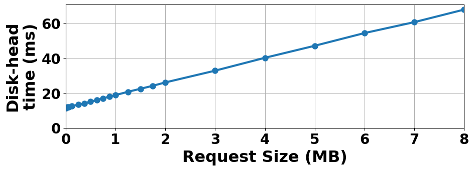
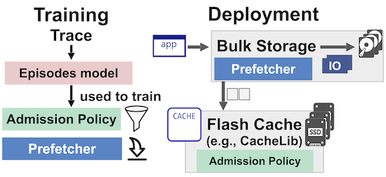
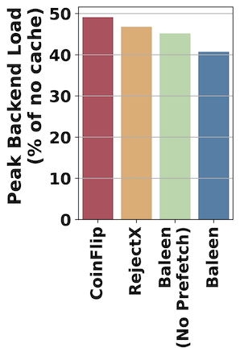
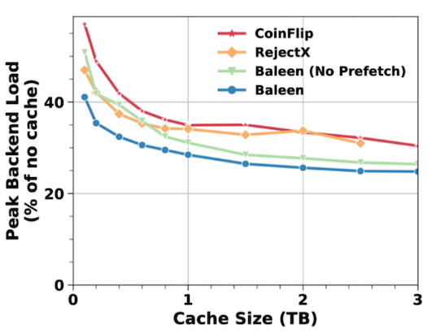
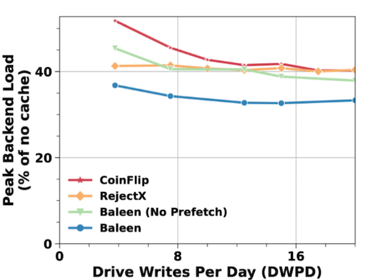

+++
# The title of your blogpost. No sub-titles are allowed, nor are line-breaks.
title = "Baleen: ML admission & prefetching for flash caches"
# Date must be written in YYYY-MM-DD format. This should be updated right before the final PR is made.
date = 2023-05-09

[taxonomies]
# Keep any areas that apply, removing ones that don't. Do not add new areas!
areas = ["Systems"]
# Tags can be set to a collection of a few keywords specific to your blogpost.
# Consider these similar to keywords specified for a research paper.
tags = ["flash", "cache", "ml-for-caching", "admission", "prefetching"]

[extra]
# For the author field, you can decide to not have a url.
# If so, simply replace the set of author fields with the name string.
# For example:
#   author = "Harry Bovik"
# However, adding a URL is strongly preferred
author = {name = "Daniel Lin-Kit Wong", url = "http://www.cs.cmu.edu/~dlwong" }
# The committee specification is simply a list of strings.
# However, you can also make an object with fields like in the author.
committee = [
    "George Amvrosiadis",
    "Rashmi Korlakai Vinayak",
    "Thomas S. Kim",
]
+++

<!-- After filling in the above "top-matter", as per instructions provided
in the `.md` file, you can write the main body of the blogpost here
onwards. Commonly used examples of syntax are shown below.

You can run `./local_server.sh` at the root of the repository to see
how the final blogpost looks in action. -->

# Introduction
Large-scale storage is still dominated by hard disks (HDDs) as they are cost-effective. However, HDDs are limited to \~100 IOs per second. Thus, modern storage systems in datacenters widely rely on flash caches to absorb backend load and reduce the number of HDDs required to satisfy the IO workload.

While flash has orders of magnitude higher IOPS, it suffers from wearout as it is written to. 
Flash drives lifetime projections assume relatively low average write rates such as "three drive-writes per day (DWPD)", meaning 3N TB of writes to a N TB flash drive each day. Flash drives with even lower write endurance (e.g., 1 DWPD) are priced correspondingly lower. Given that traditional cache management policies designed for dynamic random-access memory (DRAM) can incur writes exceeding 100 DWPD, there is a need for smart flash admission policies to filter the right items to be written into cache.

Machine learning (ML) policies have been proposed to improve upon historically popular policies, which include random admission and history-based policies that reject items without sufficient recent usage. However, caching is a challenging problem for ML to get right[[3]](https://pdl.cmu.edu/PDL-FTP/BigLearning/2018MachineLearningCDNcache_HOTNETS.pdf). Furthermore, systems practitioners desire that policies also be understandable in addition to being performant[[4]](https://www.usenix.org/system/files/atc22-yang-tzu-wei.pdf).

We decompose the flash caching problem into admission, prefetching, and eviction. This helps us align policy decisions to well-understood supervised ML techniques. We also co-design these components, as we show that a policy can have synergistic or antagonistic effects on other parts of the system.

The Baleen flash cache exploits a new cache residency model (which we call episodes) to improve ML training effectiveness. The episodes model also enables a new useful comparison point (OPT). Baleen focuses on optimizing for an end-to-end metric (HDD disk-head time) that balances IOPS and bandwidth, rather than hit rate. We find that a combination of ML-guided admission and ML-guided prefetching works best in reducing peak backend load.

Baleen reduces HDD peak load by 11.8% over state-of-the-art policies on seven recent real-world storage cluster traces collected over 3 years. This work is under submission.

# Background: Bulk storage systems

Bulk storage systems are relied on by hyperscalars to aggregate persistent
storage needs in data centers including blob storage and data warehouses
(such as HDFS[[7]](https://hadoop.apache.org)). Users might not
even know they are using one, as such systems function quietly behind the scenes
at cloud computing platforms like Amazon Web Services, Google Cloud Platform and
Microsoft Azure. In this paper, we use Meta's Tectonic[[2]](https://www.usenix.org/system/files/fast21-pan.pdf) as an important
and representative example of a bulk storage system. Many other systems have a
similar design (e.g., Google's Colossus[[4]](https://www.usenix.org/system/files/atc22-yang-tzu-wei.pdf)[[5]](https://cloud.google.com/blog/products/storage-data-transfer/a-peek-behind-colossus-googles-file-system), YouTube[[6]](https://www.usenix.org/system/files/nsdi23-song-zhenyu.pdf)). In Tectonic, as in other systems[[5]](https://cloud.google.com/blog/products/storage-data-transfer/a-peek-behind-colossus-googles-file-system)[6], flash caches are used to reduce load on the backing HDDs and meet throughput requirements.

Accesses are made to byte ranges within blocks. Blocks are mapped to a location on backing HDDs, and subdivided into many smaller units called segments that can be individually cached (Tectonic has 8 MB blocks and 128 KB segments). Upon an access, the cache is checked for all segments needed to cover the request byte range. If any are missing, an IO is made to the backing store to fetch them, at which point they can be admitted into the cache.

The storage system has 10,000s of storage nodes independently serving requests. The ratio of backing HDD space : flash cache : DRAM cache is 37,800 : 40 : 1. We focus on the scope of an individual node.

## Bulk storage limited by disk-head time

At scale, hard disks (HDDs) remain the choice of backing store as they are cheaper by an order of magnitude per GB than SSDs[[8]](https://web.archive.org/web/20221004225419/https://blocksandfiles.com/2020/08/24/10x-enterprise-ssd-price-premium-over-nearline-disk-drives). Newer HDDs offer increased storage density, resulting in shrinking IO capacity (IOPS and bandwidth) per GB as more GBs are served by the same disk head.

<em>Fig 1: <b>Disk-head Time</b> consists of a seek & transfer time. This reflects disk-head times on our testbed.</em>

Disk-head time on backing HDDs is a premium resource. The mechanical nature of HDDs results in a high, size-independent access time penalty (e.g., 10 ms) for positioning the read/write head. With a high read rate (e.g., 5.5 ms per MB) and a maximum block size of 8 MB, a request could take 10 to 70 ms. In provisioning bulk storage, peak demand for disk-head time matters most.  If the system has insufficient IO capacity, requests queue up, and slowdowns occur. If sustained, clients retry requests and failures occur, affecting user experience. Thus, bulk storage IO requirements are defined by peak load, which in turn affects storage costs.

## Flash caches absorb backend load but have limited write endurance

Flash caching plays an important role in absorbing backend load, compensating for disk-head time limitations of the underlying HDDs. This setup enables resource-efficient storage for workloads that exceed the throughput requirements of HDDs but which are infeasible to store using flash alone. With the trends towards higher density HDDs and fewer bytes per HDD spindle, flash caches unlock more usable bytes per spindle.

Flash does not have access setup penalties, but does have wearout that translates into long-term average-write-rate limits. SSD manufacturers rate their drives’ endurance in terms of drive-writes per day (DWPD) over their warranty period.

Caching is an especially challenging workload for flash, since items will have widely varying lifetimes, resulting in a usage pattern closer to random I/Os than large sequential writes. Items admitted together may not be evicted at the same time, worsening write amplification. Writing every miss into flash would cause it to wear out prematurely.

Flash caches leverage **admission policies** (APs) to decide if items should be inserted into the flash cache or discarded, and have simple eviction policies (Least Recently Used, First-In First-Out) to minimize write amplification[[1]](https://www.usenix.org/system/files/osdi20-berg.pdf). Like eviction policies, admission policies weigh the benefit of hits from new items against lost hits from evicted items. They must also weigh the write cost of admitting the new item against other past or future items. Policies have an admission threshold that can be varied to achieve the target flash write rate. We provide some examples.

- **CoinFlip (baseline)** On a miss, segments for an access are either all admitted, or not at all, with probability 𝑝. This simple policy does not need tracking of past items seen.
- **RejectX (baseline)** rejects a segment the first _X_ times it is seen. Past accesses are tracked using probabilistic data structures similar to Bloom filters. We use X = 1 and vary the window size of past accesses to achieve the desired write rate. Both Meta [[1]](https://www.usenix.org/system/files/osdi20-berg.pdf) and Google [[4]](https://www.usenix.org/system/files/atc22-yang-tzu-wei.pdf) used this prior to switching to more complex policies.
- **ML admission policies** use offline features to make decisions in addition to online features such as past access counts. A ML model can be trained offline based on a trace (as we do), or online using reinforcement learning.

# Baleen Design

## Optimize for Disk-head time, not hits or bandwidth
We propose that backing store load be measured using disk-head time (DT), which is a throughput metric that balances IOPS and bandwidth.

**Definition**: Disk-Head Time (DT) is the cost of serving a single request to the backend. For a single IO that fetches _n_ bytes:

 $$ DT(n) = SeekTime + TransferTime * n $$

Policies are then assessed in terms of Disk-Head Time saved, rather than
object-level hits (corresponding to IOPS) or byte-level hits (corresponding to 
bandwidth). Disk-Head Time can also be seen as a weighted sum of object-level
hits and byte-level hits.
We use Disk-Head Time to score episodes for OPT (our approximate optimal online
admission policy) and ultimately generate labels for training Baleen's ML
admission policy. In training Baleen's prefetcher, we use Disk-Head Time to
assess the benefit of prefetching for a particular episode.

System capacity, such as the number of backend servers, is provisioned to handle peak load in systems that need to meet realtime demand. Therefore, to reduce the backend size, one should minimize peak disk-head time. This introduces the need for scheduling (i.e., when to spend the flash write rate budget) to prioritize the admission of items that contribute to peak disk-head time. As explicitly optimizing for the peak introduces significant complexity, we leave that for future work. For Baleen, we design our methods to minimize average disk-head time, but show that they are successful in reducing peak disk-head time as well.

## Decomposing caching into admission, prefetching and eviction

We define the caching problem as determining which times we should fetch, admit and evict each segment in order to minimize the backend's DT given a flash write rate limit.

We propose a heuristic decomposition of this problem into three sub-problems: admission, prefetching, and eviction. This makes it easier to reason about the optimal solutions to each sub-problem and the training and behavior of ML solutions for each part.

**Admission:** Whether to admit something into cache in anticipation of future hits that reduce disk-head time. We trade off the disk-head time saved against the write rate used from caching an item. We model admission as a binary classifier, where misses are admitted if the outout probability exceeds the policy threshold.

**Prefetching:** Whether to prefetch extra segments outside the current access range (which was a miss). We trade off disk-head time saved from hits on the first accesses against the additional time spent in cache, and for incorrect prefetches, the disk-head time wasted and the opportunity cost of the wasted flash write rate. We further decompose the prefetching problem into a) deciding what segments to prefetch and b) when to prefetch (whether the expected benefit exceeds the cost, taking into account the possibility of mispredictions)

**Eviction:** Which segment in the cache to pick for eviction upon an admission. One can employ existing approaches for non-flash caches, including ML-based policies. We employ a simple eviction policy (in our case, Least Recently Used) as is used in production systems, leaving ML-based flash-aware eviction policies for future work.

## Introducing episodes: an offline model for flash caching

We devised an offline model for flash caching for efficient evaluation of flash caching improvements, and to facilitate the training of ML-based policies. This model revolves around episodes, which are defined as:

**Definition** An **episode** is a sequence of accesses that would be hits (apart from the first access) if the corresponding item was admitted. It is defined on a block, and may span multiple segments. As shown in Fig 2, an episode’s size is the number of segments needed to cache it, and its timespan is the length of time between the first access of any segment and the last eviction of a segment.

<em>Fig 2: Episodes span space (measured in segments) in addition to time. An episode’s size is the smallest number of segments required to be admitted to get all possible hits within an episode. OPT-Range is (1,3) and (2,3) respectively.
</em>

<em>Fig 3: An episode is a group of accesses corresponding to a block’s residency. Accesses (in blue) are grouped into two episodes as the interarrival time (in red) exceeds the assumed eviction age.</em>

We generate episodes by exploiting the model of a LRU (Least Recently Used) cache as evicting items a constant logical time (eviction age) after the last access. In a LRU cache, the eviction age is the logical time between an item’s last access & eviction. As shown in Fig 3, we group accesses into episodes such that all inter-arrival times within episodes are no larger than the assumed eviction age.

Episodes provide a direct mapping to the costs and benefits associated with an admission, and which corresponds directly to the decisions actually being made by admission policies. These benefits and costs are associated with a item’s entire lifespan in cache, and are not obvious from looking at a stream of individual accesses. Moreover, with flash caching, it is optimal to admit as early as possible in the episode, given that the flash writes required are a fixed cost. By shifting the mental model from interdependent accesses to independent episodes, we can reason about decisions more easily.

Decisions on episodes can be made independent by assuming a constant eviction age. This also allows decisions to be made in parallel. The added pressure on cache space via an admission is accounted for via downwards pressure on the eviction age. We determine an appropriate eviction age using simulations that measure the average eviction age.

The episode model also allows for an efficient offline analytical analysis of policies via Little’s Law. Given the arrival rate and assumed eviction age, we can estimate the cache size required, and set eviction age such that the analytical cache size is equal to the cache size constraint. While this is much more efficient than an online simulation and is useful to explore a greater range of parameters than is possible with online simulation, the numbers will differ from simulated ones as the cache size constraint is not enforced all the time, only as a long-term average.

Admission policies can be viewed as partitioning these episodes into those admitted and discarded. This can be done via scoring episodes and ranking them by score.

# Baleen System Architecture

<em>Fig 4: Baleen System Architecture.</em>

We describe Baleen's architecture in terms of what happens at training time and when deployed with a CacheLib[[[1]](https://www.usenix.org/system/files/osdi20-berg.pdf) implementation. At training time, episodes are generated and used to train Baleen's ML admission and ML prefetching policies. At deployment time, the trained models are supplied to CacheLib which uses them to make decisions on the fly.

## OPT approximates optimal online admission policy ##
We devise an online admission policy, **OPT**, that we train Baleen's ML policy to imitate. In OPT, first, each block's accesses are grouped into episodes using an assumed eviction age. Second, all episodes are scored using the equation below and sorted. Last, the maximum number of episodes are admitted such that the total flash writes required do not exceed the write rate budget. During online simulation, accesses will be admitted if they belong to episodes that were marked as admitted during the offline process.

$$ Score(Episode)= \frac{DTSaved(Episode)}{Size(Episode)} $$

## Training Baleen to imitate OPT
We use OPT's decisions as binary labels for training Baleen. Training examples are added for the first k (k = 6) accesses of each episode (to avoid biasing the training set towards popular but easy episodes). Features include offline metadata provided by the bulk storage system (which help identify which application the request originates from) and online history-based counts (how many hits the object has received in the last 1,2,3,4,5,6 hours).

## Training Baleen to predict what and when to prefetch
By default, on a miss, the smallest IO that covers all missed segments is made, i.e., no prefetching occurs. It is possible to extend this IO and preemptively admit more segments. If done correctly, this reduces the total no of IOs needed and thus reduces Disk-head Time.

Baleen has two prefetching models: ML-Range, and ML-When.

## Learning what to prefetch: ML-Range learns from OPT-Range
OPT-Range is the minimal range of segments that will cover all accesses in an episode. Using the episodes model, we generate OPT-Range for each episode and use these as labels for ML-Range.

ML-Range is a ML model that predicts a range of segments for prefetching. We use the same features as the ML admission model, but add size-related features (access start index, access end index, access size). We train two regression models to predict the episode range start and end. Each episode is represented once in the training data, with only episodes that meet the score cutoff for the target write rate included

## Learning when to prefetch: ML-When
Fetching insufficient segments results in minimal or no Disk-head Time reduction. On the other hand, fetching excess segments results in a high write rate. To balance these tradeoffs, we need to know our confidence in our range prediction.

Mispredictions by the ML admission policy and in ML-Range can easily cause prefetching to hurt instead of help. In reality, the expected benefit will be lower than OPT prefetching and the cost can only be higher. The disk-head time saved from prefetching ML-Range may not be realized. Moreover, prefetching mispredictions are costly in terms of disk-head time consumed to fetch unused segments and the opportunity cost of flash writes used to store them. ML-When aims to address this and exclude epsiodes that do not have a high probability of benefiting from prefetching. 
The exact equations are provided in our paper.

# Evaluation
We evaluate Baleen using a testbed and a simulator. We validate both with counters from production deployments. Each node in our testbed has a 400 GB flash drive and 2 4TB HDDs.

We report results on 7 Meta production traces collected in 2019, 2021 and 2023 and take an average across the traces.
These traces show week-long workloads on 7 Tectonic clusters from 3 different years,
with each cluster serving the storage needs of an entire data center[[2]](https://www.usenix.org/system/files/fast21-pan.pdf).
Each trace represents 7 days of production traffic from a single
cluster (except for Region3, which has 3 days), with traffic sampled at every
node (each cluster has thousands of nodes) and later aggregated into a trace.
The Region1 and Region2 traces were recorded from different clusters over the same 7 days in Oct 2019, while the Region3 trace was recorded from another cluster over 3 days in Sep 2019. Region4 was recorded over 7 days in Oct 2021, and the remaining traces (Region5, Region6, Region7) were collected in Mar 2023.

<em>Fig 5: Baleen reduces Peak Disk-head Time (DT) by an average of 11.8% over the best non-ML policy (RejectX), and 18.6% over random admission on 7 production traces from Meta under flash write rate constraints.</em>

Fig 5 shows Baleen reduces Peak DT over RejectX by an average of 11.8% across all traces.
In our paper, we show this ranges from 4.8% to 22.6% across the 7 traces,
with 3 regions deriving most of their gains from prefetching.

<em>6a) Cache Sizes</em>

<em>6b) Write Rates</em> 
<em>Fig 6: Baleen continues to deliver improvements at higher cache sizes and write rates.</em>

Fig 6 shows that the benefits of Baleen are consistent at higher cache sizes and write rates, with Baleen enabling a reduction in cache size by 55% while keeping
the same Peak DT as RejectX, or alternatively a reduction in Peak DT equivalent
to a 4X increase in cache size. As expected, increasing write rate or cache size has diminishing returns in reducing Peak DT. Also, the different admission policies (without prefetching) start to converge, indicating that admission by itself is insufficient to drive further reductions in Peak DT. We provide graphs for all 7 traces in our
paper.

Further results are available in our paper, such as:
1. **Prefetching should be selective and in tandem with admission**
We show both ML-Range and ML-When are effective in reducing Peak DT over static baselines, and contribute to Baleen’s robustness across the multiple traces.
We also show that prefetching must be paired with a good admission policy; if not, the same prefetching policy can hurt rather than help.
2. **Optimizing the right metric: Peak DT** We show how optimizing for IO
hit ratio can be misleading, as doing so is optimal for reducing seeks, not
Disk-head Time.
3. **Validation of simulator and testbed.** We validated Baleen on our simulator
against Baleen on our testbed. We took the additional step of showing that our
testbed is consistent with production counters.
4. **Trace analysis** We show distributions for block popularity, interarrival times, access sizes and the compulsory miss trace, one-hit-wonder trace (fractions of blocks
with no reuse) and Admit-All flash write rate.

In our paper, we described a few lessons gleaned from 3 years of deploying ML
in production caches at Meta. These lessons were that 1) optimizing the wrong metric is an easy misstep, 2) ML model performance does not always translate to production system performance, 3) to rethink the use of DRAM in flash caching, and that 4) ML-based caching should aim for encapsulation of ML, caching, and storage.
To read more, please see Section 6 (Lessons from deploying ML in production) of our paper.

# Conclusion

Baleen is a flash cache that uses ML to guide both prefetching and cache admission, reducing peak storage backend load on real workload traces from Meta. Baleen's design arose from a number of false-step lessons and a cache residency (episodes) formulation that improves training effectiveness, provides an ideal (OPT) target, and exposed the particular value of ML-guided prefetching. As such, Baleen is an important step forward in flash caching for disk-based storage systems.

More details are available in our paper, which is under submission. Please
direct any correspondence to [Daniel Wong](mailto:wonglkd@cmu.edu).

# Acknowledgements

This post is based on the paper _Baleen: ML Admission & Prefetching for Flash Caches_. I would like to thank my collaborators and the CacheLib and Tectonic teams at Meta: Carson Molder (UT Austin), Hao Wu (Meta), Sathya Gunasekar (Meta), Jimmy Lu (Meta), Snehal Khandkar (Meta), Abhinav Sharma (Meta), Daniel S. Berger (Microsoft Research & University of Washington), Nathan Beckmann (CMU), and Greg Ganger (CMU).
I would also like to thank the reviewers of this post: George Amvrosiadis,
and Thomas Kim.

# References

1. Benjamin Berg, Daniel S Berger, Sara McAllister, Isaac Grosof, Sathya Gunasekar, Jimmy Lu, Michael Uhlar, Jim Carrig, Nathan Beckmann, Mor Harchol-Balter, et al. [The CacheLib caching engine: Design and experiences at scale.](https://www.usenix.org/system/files/osdi20-berg.pdf) In 14th USENIX Symposium on Operating Systems Design and Implementation (OSDI 20), 2020.
2. Satadru Pan, Theano Stavrinos, Yunqiao Zhang, Atul Sikaria, Pavel Zakharov, Abhinav Sharma, Mike Shuey, Richard Wareing, Monika Gangapuram, Guanglei Cao, et al. [Facebook’s Tectonic filesystem: Efficiency from exascale.](https://www.usenix.org/system/files/fast21-pan.pdf) In 19th USENIX Conference on File and Storage Technologies (FAST 21), 2021
3. Daniel S Berger. [Towards lightweight and robust machine learning for CDN caching.](https://pdl.cmu.edu/PDL-FTP/BigLearning/2018MachineLearningCDNcache_HOTNETS.pdf) In Proceedings of the 17th ACM Workshop on Hot Topics in Networks (HotNets), 2018.
4. Tzu-Wei Yang, Seth Pollen, Mustafa Uysal, Arif Merchant, and Homer Wolfmeister. [CacheSack: Admission optimization for google datacenter flash caches.](https://www.usenix.org/system/files/atc22-yang-tzu-wei.pdf) In USENIX Annual Technical Conference (USENIX ATC 22), 2022.
5. Dean Hildebrand and Denis Serenyi. [Colossus under the hood: a peek into google’s scalable storage system](https://cloud.google.com/blog/products/storage-data-transfer/a-peek-behind-colossus-googles-file-system), 2021
6. Zhenyu Song, Kevin Chen, Nikhil Sarda, Deniz Altınbüken, Eugene Brevdo, Jimmy Coleman, Xiao Ju, Pawel Jurczyk, Richard Schooler, and Ramki Gummadi. [Halp: Heuristic aided learned preference eviction policy for youtube content delivery network.](https://www.usenix.org/system/files/nsdi23-song-zhenyu.pdf) In 20th USENIX Symposium on Networked Systems Design and Implementation (NSDI 23), 2023.
7. Apache Software Foundation. (2010). [Hadoop](https://hadoop.apache.org).
8. [Chris Mellor. Enterprise ssds cost ten times more than nearline disk drives.](https://web.archive.org/web/20221004225419/https://blocksandfiles.com/2020/08/24/10x-enterprise-ssd-price-premium-over-nearline-disk-drives) Accessed: 2022-10-04.
